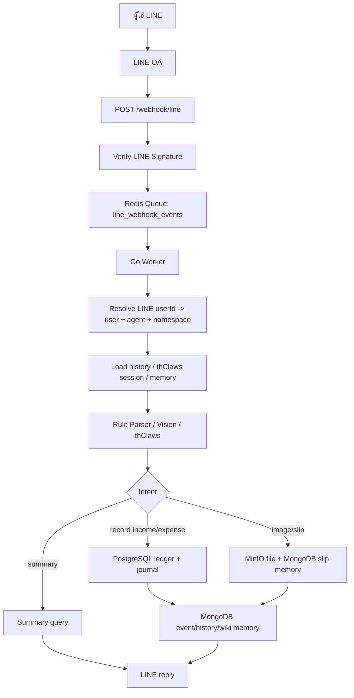

# ThaiAiAgent

LINE OA AI Agent ภาษาไทยสำหรับเลขาส่วนตัวและบัญชีครัวเรือน โดยใช้ `thClaws` เป็นสมองกลางของระบบ เชื่อมกับ LINE OA, LIFF Mini App, PostgreSQL, MongoDB, Redis และ MinIO

ระบบนี้ออกแบบให้คนไทยใช้ง่าย: พิมพ์รายการรับจ่าย ส่งรูปสลิป เปิด Mini App ดูกราฟ/สมุดบัญชี/โครงการ และให้ AI ช่วยวิเคราะห์การเงินจากข้อมูลจริงของผู้ใช้เท่านั้น

## ภาษาที่ใช้พัฒนา

| ภาษา | ใช้ทำอะไร |
|---|---|
| Go | runtime หลักของ API, LINE webhook, worker, parser, ledger, LIFF API, queue consumer |
| TypeScript / Node.js | โครง legacy และ service บางส่วนระหว่าง migration |
| SQL | PostgreSQL schema, migration, ledger query |
| Prisma Schema | model ฝั่ง Node/TypeScript และ migration reference |
| HTML / CSS / JavaScript | LIFF Mini App แบบ mobile-first |
| Docker Compose | local dev และ production stack |

แนวทางปัจจุบันคือให้ Go เป็นเส้นทางหลักของ production เพราะตอบเร็วกว่าและ deploy ง่ายกว่า ส่วน TypeScript ยังเก็บไว้เพื่ออ้างอิง/ย้ายระบบทีละส่วน

## โปรแกรมที่จำเป็น

- Docker / Docker Compose
- Go 1.25+
- Node.js 20+ สำหรับ legacy tooling และ Prisma
- PostgreSQL
- MongoDB
- Redis
- MinIO
- Caddy สำหรับ HTTPS production
- LINE Developers account
- LINE Messaging API channel
- LIFF app สำหรับ Mini App
- SMLGateway API key ถ้าต้องการใช้ AI ผ่าน `https://smlgateway.smlsoftdemo.com/v1`

## Service หลัก

| Service | หน้าที่ |
|---|---|
| lineWebhookService | รับ LINE webhook, verify signature, enqueue event |
| lineReplyService | reply ผ่าน replyToken เท่านั้น ห้าม push |
| userService | map LINE userId เป็น user/agent/namespace |
| agentService | เตรียม personal agent และ session ของ thClaws |
| ledgerService | บันทึก transaction, double-entry journal, project allocation |
| transactionParserService | parse รายรับรายจ่ายภาษาไทยแบบ rule-first |
| memoryService | เก็บ history, memory, wiki brain, รูป/สลิป metadata ใน MongoDB |
| permissionService | ตรวจสิทธิ์ตาม user/namespace |
| auditService | log action สำคัญ |
| queueService | Redis/Asynq queue สำหรับ LINE event และงาน async |
| summaryService | สรุปวันนี้ เดือนนี้ ยอดคงเหลือ และ dashboard |
| mcp | โครงสำหรับต่อ Agent-to-Agent / tool calling ระยะถัดไป |

## Flow ระบบ



กติกาสำคัญ:

- LINE webhook ต้อง verify signature ก่อนเสมอ
- ทุก event ต้องเข้า queue ก่อนประมวลผล
- ใช้ LINE replyToken เท่านั้น
- ห้าม push / multicast / broadcast เพื่อลดค่าใช้จ่ายและป้องกันส่งข้อความโดยไม่ได้ร้องขอ
- ทุกข้อมูลผูกกับ `userId` และ `namespace`
- ห้ามใช้ memory หรือ ledger ของคนอื่นมาตอบ

## Database และ Storage

### PostgreSQL

ใช้เป็น projection และตัวช่วยคำนวณบัญชี:

- users
- agents
- transactions
- chart_accounts
- journal_entries
- journal_lines
- ledger_events
- projects
- transaction_project_allocations
- permissions
- consents
- audit_logs
- tool_calls
- cost_logs

### MongoDB

ใช้เป็นแหล่งเก็บ log/memory หลัก:

- conversation messages
- event logs
- stored image metadata
- slip records
- memory items
- memory summaries
- conversation snapshots
- agent profiles
- personal wiki brain
- thClaws session state

### MinIO

ใช้เก็บไฟล์รูป/สลิปแบบ raw object ห้ามเก็บรูปเป็น base64 ถาวร

### Redis

ใช้ queue และ async jobs:

- line_webhook_events
- agent_jobs
- memory_jobs
- summary_jobs
- notification_jobs

## Namespace และความปลอดภัยข้อมูล

ข้อมูลทุกอย่างแยกตาม LINE ID ผ่าน namespace:

```text
memory:user:{userId}
ledger:user:{userId}
memory:household:{householdId}
ledger:household:{householdId}
memory:business:{businessId}
ledger:business:{businessId}
```

ทุก query สำคัญต้อง filter ด้วย:

- `userId`
- `namespace`
- permission/scope ที่เกี่ยวข้อง

หลักความปลอดภัย:

- token/API key อยู่ใน `.env` เท่านั้น
- `.env` ห้าม commit
- ไม่ log token หรือ raw secret
- ไม่ตอบจากข้อมูลของ user คนอื่น
- ไม่เดาข้อมูลบัญชี ถ้าไม่มีข้อมูลจริงให้บอกว่าไม่พบข้อมูล
- รูปเก็บเป็นไฟล์ใน MinIO ไม่เก็บ base64 ถาวร
- เตรียมโครง delete/export data เพื่อ PDPA

## ความสามารถของระบบ

### LINE OA Chat

- รับข้อความจากผู้ใช้ผ่าน LINE OA
- verify LINE signature
- enqueue event เข้า Redis ก่อน worker ประมวลผล
- map LINE userId เป็น user + personal agent อัตโนมัติ
- เปิด thClaws session แยกตาม namespace
- บันทึกประวัติการคุยใน MongoDB
- compact/history/wiki brain สำหรับคุยต่อเนื่อง
- reply แบบ text, quick reply, Flex message ตามความเหมาะสม
- ถ้าประมวลผลเกินเวลา ตอบว่า “หมดเวลาประมวลผล” ผ่าน replyToken

### Parser บัญชีภาษาไทย

ตัวอย่างที่รองรับ:

```text
กาแฟ 60
ข้าว 55
ค่าไฟ 980
ค่าน้ำ 120
เงินเดือน 25000
ขายของ 1500
ซื้อของเข้าบ้าน 1200
เมียให้เงินสองร้อย
จ่ายให้แม่ 500
รับจากลูกค้า 1500
```

ถ้า parser ไม่มั่นใจ ระบบจะถามยืนยันก่อน เช่น:

- รายรับ
- รายจ่าย
- โอนเงิน
- ไม่บันทึก

### บัญชีแยกประเภท

เมื่อบันทึกรายรับ/รายจ่าย ระบบสร้าง:

- transaction
- journal entry
- journal lines
- ledger event

แนวคิดบัญชี:

- รายรับ: Dr เงินสด/เงินฝาก, Cr รายได้
- รายจ่าย: Dr ค่าใช้จ่าย, Cr เงินสด/เงินฝาก
- ตรวจเดบิต = เครดิตใน dashboard

### สรุปบัญชี

คำสั่งที่รองรับ:

```text
สรุปวันนี้
วันนี้จ่ายค่าอะไรไปบ้าง
สรุปเดือนนี้
เดือนนี้ใช้ไปเท่าไร
เงินเหลือเท่าไหร่
สรุปบัญชี
```

ระบบตอบจาก transaction จริงเท่านั้น ไม่แต่งตัวเลขเอง

### รูปภาพและสลิป

- รับรูปจาก LINE
- download content จาก LINE
- เก็บไฟล์จริงใน MinIO
- เก็บ metadata ใน MongoDB
- ส่งรูปให้ AI vision อ่านสลิปเมื่อจำเป็น
- วิเคราะห์ว่าเป็นรายรับ รายจ่าย หรือโอนเฉย ๆ
- ถ้าไม่มั่นใจต้องถามผู้ใช้ก่อนบันทึก
- สามารถเรียกดู/วิเคราะห์รูปล่าสุดได้

### โครงการ / Project Accounting

รองรับการแยกบัญชีตามโครงการ เช่น:

- โครงการสร้างบ้าน
- โครงการสร้างร้าน
- งานสวน
- ทริปครอบครัว

ความสามารถ:

- เพิ่มโครงการได้เรื่อย ๆ
- เปลี่ยนชื่อโครงการได้
- ตั้งงบประมาณโครงการได้
- ตั้งวันเป้าหมายได้
- รายการเดียว allocate เข้าได้หลายโครงการ
- รายรับ/รายจ่ายลบได้
- เปลี่ยนวันที่และเวลาได้
- แก้ counterparty เช่น รับจากใคร / จ่ายให้ใคร / โอนให้ใคร
- รายการที่ยังไม่ผูกโครงการจะแสดงใน Mini App ส่วน “รอตรวจจัดสรร”

ตัวอย่างจาก LINE:

```text
ซื้อปูน 5000 โครงการสร้างบ้าน
ค่าแรง 3000 #สร้างร้าน
ขายของ 12000 โครงการร้านใหม่
```

ถ้าระบุชื่อโครงการชัดเจนและยังไม่มี ระบบสร้างโครงการให้อัตโนมัติ

### LIFF Mini App

Mini App ออกแบบสำหรับมือถือใน LINE:

- สมุดบัญชี
- เงินเข้าออก
- เอกสาร/รูปภาพ
- วิเคราะห์หนัก ๆ
- โครงการ
- รอตรวจจัดสรร
- กราฟรับ-จ่าย
- หมวดรายจ่าย
- บัญชีแยกประเภท

ทุกจอเลือกช่วงวันที่ได้หลายแบบ:

- วันนี้
- 7 วัน
- 30 วัน
- เดือนนี้
- เดือนก่อน
- ไตรมาสนี้
- ปีนี้
- custom date range

ระบบ auto refresh และแสดงตัวเลขพร้อม comma เช่น `25,000 บาท`

## thClaws ในระบบนี้

`thClaws` เป็นสมองกลางของระบบ:

- วิเคราะห์บริบทจาก history
- คุม session แยกตาม user namespace
- วางแผนการตอบ
- ตัดสินใจถามกลับเมื่อข้อมูลไม่พอ
- ช่วยตอบคำถามทั่วไปแบบเลขาส่วนตัว
- ใช้ SMLGateway ผ่าน OpenAI-compatible endpoint

กติกา AI:

- rule parser ก่อน AI สำหรับงานง่าย
- ไม่ส่งทุกข้อความเข้า LLM ใหญ่โดยไม่จำเป็น
- ไม่มั่วข้อมูลบัญชี
- ไม่อ้างว่าบันทึกแล้วถ้ายังไม่มี ledger write จริง
- ถ้าค้นเว็บไม่ได้ให้บอกตรง ๆ
- ถ้าข้อมูลไม่พอให้ถามกลับ

## Local Development

เตรียม env:

```bash
cp .env.example .env
```

รัน dependency:

```bash
docker compose up -d postgres mongodb redis minio nats
```

รัน Go test:

```bash
cd go-core
go test ./...
```

รัน API/worker:

```bash
docker compose up -d go-api go-worker
```

Webhook URL:

```text
https://your-domain.com/webhook/line
```

Mini App:

```text
https://your-domain.com/liff/dashboard
```

## Production

Stack production:

- Caddy reverse proxy
- Go API
- Go worker
- PostgreSQL
- MongoDB
- Redis
- MinIO
- NATS
- migration container

Domain ปัจจุบัน:

```text
https://thaiaiagent.smlsoft.app
```

LINE webhook:

```text
https://thaiaiagent.smlsoft.app/webhook/line
```

Health check:

```text
https://thaiaiagent.smlsoft.app/health
```

## Environment Variables สำคัญ

ดูตัวอย่างใน `.env.example`

ค่าที่ต้องมีใน production:

- `LINE_CHANNEL_SECRET`
- `LINE_CHANNEL_ACCESS_TOKEN`
- `LIFF_ID`
- `LIFF_CHANNEL_ID`
- `PUBLIC_BASE_URL`
- `POSTGRES_*`
- `MONGODB_URI`
- `REDIS_ADDR`
- `MINIO_*`
- `SML_GATEWAY_BASE_URL`
- `SML_GATEWAY_API_KEY`
- `THCLAWS_MODEL`
- `LIFF_SESSION_SECRET`
- `IMAGE_ACCESS_SECRET`

ห้าม commit `.env`

## Folder สำคัญ

```text
src/                         legacy TypeScript app
go-core/cmd/api              Go API server
go-core/cmd/worker           Queue worker
go-core/cmd/outbox           Event outbox relay
go-core/internal/line        LINE webhook/reply/signature
go-core/internal/dispatcher  Intent routing และ orchestration
go-core/internal/parser      Thai transaction parser และ vision parser
go-core/internal/ledger      transaction, journal, summary, project allocation
go-core/internal/liff        LIFF API และ static Mini App
go-core/internal/memory      MongoDB memory/history/wiki
go-core/internal/queue       Redis/Asynq queue
go-core/internal/agents      SMLGateway/thClaws client
go-core/migrations           PostgreSQL migrations สำหรับ Go runtime
prisma/schema.prisma         Prisma schema/reference
tests/                       test assets
```

## Tests

ตัวอย่างคำสั่ง:

```bash
cd go-core
go test ./internal/ledger ./internal/line ./internal/liff ./internal/dispatcher ./cmd/api ./cmd/worker
go build ./cmd/api
go build ./cmd/worker
```

ชุด test สำคัญ:

- LINE signature verification
- no push guard
- Thai parser cases
- Thai amount words
- counterparty parsing
- LIFF session token
- ledger event/double-entry
- project allocation helpers
- web search behavior

## ข้อจำกัดปัจจุบัน

- household/business scope ยังเป็นโครงต่อยอด
- MCP Gateway ยังไม่ได้เปิด full tool executor
- สลิปที่ AI ไม่มั่นใจยังต้องรอผู้ใช้ยืนยันก่อนบันทึก
- LIFF rich menu บางกรณีต้องให้ channel ออกจาก developing status ก่อนผู้ใช้ทั่วไปเปิดได้
- TypeScript legacy ยังไม่ถูกย้ายออกทั้งหมด

## Roadmap

- Household ledger: สมาชิกบ้าน สิทธิ์ และสมุดบัญชีรวม
- Business ledger: ยอดขาย ต้นทุน กำไรสินค้า
- Budget/goal engine: เตือนงบใกล้หมดแบบไม่ push
- MCP tools:
  - `create_personal_transaction`
  - `get_personal_summary`
  - `create_household_transaction`
  - `get_household_summary`
  - `create_business_sale`
  - `record_business_purchase`
  - `get_business_profit_summary`
  - `request_coop_group_buy`
- Export/delete data สำหรับ PDPA
- เพิ่ม OCR/vision verification หลาย model
- เพิ่ม recurring transactions
- เพิ่ม dashboard รายงานภาษี/กำไรขาดทุนสำหรับร้านค้าเล็ก

## License

Private project. ใช้งานภายในทีมจนกว่าจะกำหนด license อย่างเป็นทางการ
